# Trading Bot Architecture Documentation

## Table of Contents
1. [Introduction & Overview](#introduction--overview)
2. [Trading Concepts for Programmers](#trading-concepts-for-programmers)
3. [High-Level Architecture](#high-level-architecture)
4. [Core Components Deep Dive](#core-components-deep-dive)
5. [Data Flow & Workflows](#data-flow--workflows)
6. [Strategy System](#strategy-system)
7. [Risk Management](#risk-management)
8. [Order Execution](#order-execution)
9. [Market Data Processing](#market-data-processing)
10. [Database & Persistence](#database--persistence)
11. [Configuration System](#configuration-system)
12. [Monitoring & Logging](#monitoring--logging)
13. [Testing Architecture](#testing-architecture)
14. [Deployment & Operations](#deployment--operations)
15. [Development Workflow](#development-workflow)

---

## Introduction & Overview

This document provides a comprehensive technical overview of a professional-grade automated trading bot built in Python. The bot is designed to execute trading strategies in financial markets automatically, without human intervention.

### What This Bot Does

Think of this bot as a sophisticated program that:
- **Watches** financial markets in real-time (like stock prices)
- **Analyzes** market data using mathematical strategies
- **Decides** when to buy or sell based on predefined rules
- **Executes** trades automatically through a broker's API
- **Manages** risk to prevent large losses
- **Tracks** performance and maintains detailed logs

### Key Features

- **Multi-Source Market Data**: Real-time and historical data from Alpaca, Alpha Vantage, and Yahoo Finance with intelligent fallback and cost optimization
- **Advanced Technical Indicators**: Comprehensive library with SMA, EMA, RSI, MACD, Bollinger Bands, ATR, Stochastic, and extensible framework for custom indicators
- **Professional Backtesting Engine**: Advanced metrics including Sharpe ratio, Sortino ratio, Calmar ratio, VaR, skewness, kurtosis, drawdown analysis, and benchmark comparison
- **Multiple Timeframes Support**: Aggregation and synchronization across different time periods (1m, 5m, 15m, 1h, 4h, 1d) with intelligent data management
- **Portfolio Optimization**: Modern portfolio theory algorithms including Mean-Variance optimization, Risk Parity, Kelly Criterion, and Black-Litterman framework
- **Advanced Order Types**: Stop-loss, take-profit, trailing stops, OCO (One-Cancels-Other), and bracket orders with sophisticated execution logic
- **Enhanced Risk Management**: Position sizing algorithms, volatility-based stops, correlation analysis, and comprehensive risk dashboards
- **Strategy Templates**: Professional trading strategies including mean reversion, momentum, pairs trading, arbitrage, and market making
- **Machine Learning Integration**: Feature engineering, ML models (Linear, Random Forest, XGBoost), training/validation pipeline, ensemble predictions, and feature importance analysis
- **Real-time Market Data**: Connects to live market feeds via WebSocket
- **Multiple Trading Strategies**: Supports various algorithmic trading approaches
- **Risk Management**: Built-in safeguards to limit losses
- **Order Execution**: Automated buy/sell order placement
- **Performance Monitoring**: Track profits, losses, and metrics
- **Configuration Management**: Flexible settings via environment variables
- **Comprehensive Logging**: Detailed audit trails for debugging

---

## Trading Concepts for Programmers

Before diving into the architecture, let's understand key trading concepts in programmer terms:

### Market Data
- **Quote**: Current bid/ask prices (think: buyer's highest offer / seller's lowest ask)
- **Trade**: Actual transaction that occurred
- **Bar/Candle**: Price summary over time period (open, high, low, close, volume)
- **Symbol**: Stock ticker (e.g., "AAPL" for Apple Inc.)

### Orders
- **Market Order**: Buy/sell immediately at current price
- **Limit Order**: Buy/sell only at specific price or better
- **Stop Loss**: Sell if price drops below threshold (damage control)
- **Take Profit**: Sell if price rises above threshold (lock in gains)

### Trading Strategy
- **Algorithm**: Set of rules that determine when to buy/sell
- **Signal**: Output from strategy ("BUY", "SELL", or "HOLD")
- **Position**: Currently owned shares of a stock
- **Portfolio**: Collection of all positions and cash

### Risk Management
- **Position Size**: How much money to invest in each trade
- **Stop Loss**: Maximum loss tolerable per trade
- **Daily Loss Limit**: Maximum loss tolerable per day
- **Diversification**: Spreading risk across multiple positions

---

## High-Level Architecture

The trading bot follows a microservices-inspired architecture with distinct, loosely-coupled components:

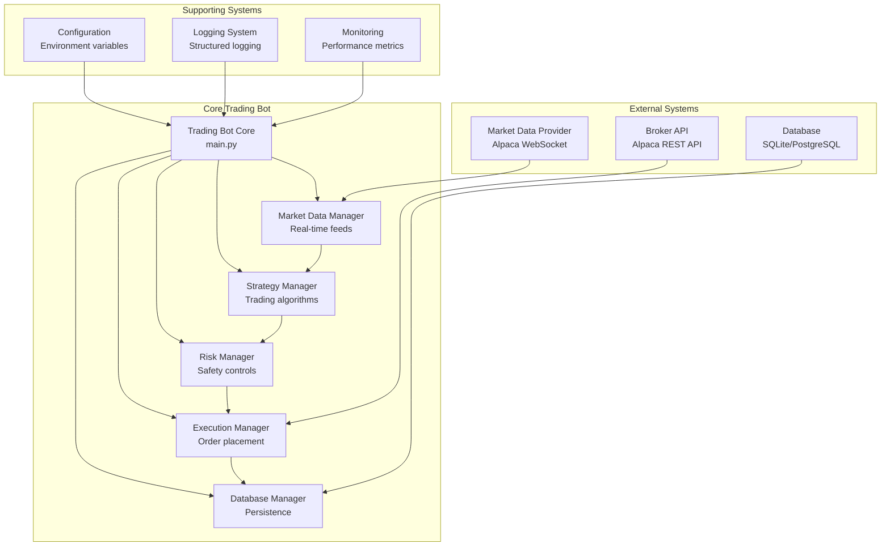

### Architecture Principles

1. **Separation of Concerns**: Each component has a single responsibility
2. **Async/Await**: Non-blocking operations for real-time performance
3. **Event-Driven**: Components communicate through events and callbacks
4. **Configurable**: All settings externalized via environment variables
5. **Testable**: Comprehensive test suite with mocking capabilities
6. **Observable**: Extensive logging and monitoring
7. **Fault Tolerant**: Graceful error handling and recovery

---

## Multi-Data Source Architecture

The trading bot now supports multiple data sources with intelligent fallback and cost optimization mechanisms.

### Data Source Architecture

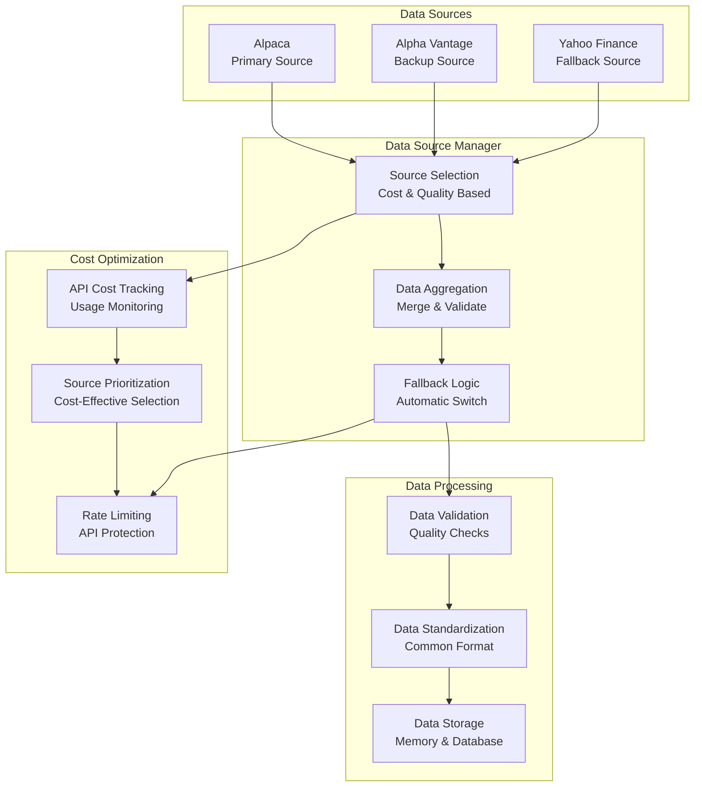

### Data Source Selection Logic

The bot intelligently selects data sources based on:
- **Cost Efficiency**: Prefers lower-cost sources when quality is comparable
- **Data Quality**: Validates data completeness and accuracy
- **Availability**: Automatic fallback when primary sources fail
- **Rate Limits**: Respects API rate limits and quotas

---

## Advanced Technical Indicators

The bot features a comprehensive technical indicators library, supporting both core and custom indicators for strategy development.

### Supported Indicators
- Simple Moving Average (SMA)
- Exponential Moving Average (EMA)
- Relative Strength Index (RSI)
- Moving Average Convergence Divergence (MACD)
- Bollinger Bands
- Average True Range (ATR)
- Stochastic Oscillator

### Extensible Framework
The indicator system is designed for easy extension. New indicators can be added by implementing a standard interface and registering with the indicator manager.

### Indicator Architecture

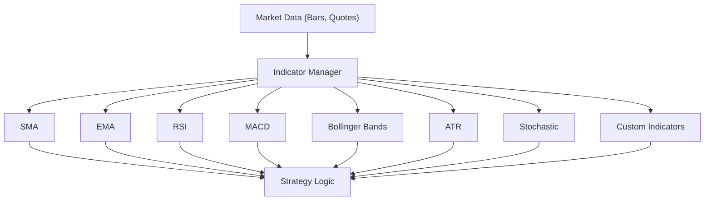

### Usage Example

```python
# Calculate indicators for a symbol
sma = indicator_manager.calculate('SMA', bars, window=20)
rsi = indicator_manager.calculate('RSI', bars, window=14)
macd = indicator_manager.calculate('MACD', bars, fast=12, slow=26, signal=9)
```

The indicator manager ensures all calculations are consistent, efficient, and available for use in any strategy.

---

## Core Components Deep Dive

### 1. Trading Bot Core (`trading_bot/core/bot.py`)

The central orchestrator that coordinates all other components.

```python
class TradingBot:
    """High-performance trading bot with async architecture."""
    
    def __init__(self, config: Config):
        # Initialize all managers
        self.market_data_manager = MarketDataManager(config)
        self.strategy_manager = StrategyManager(config)
        self.risk_manager = RiskManager(config)
        self.execution_manager = ExecutionManager(config)
        self.database_manager = DatabaseManager(config)
```

**Key Responsibilities:**
- Coordinate all subsystems
- Manage bot lifecycle (start/stop)
- Run main trading loop
- Handle graceful shutdown
- Monitor system health

**Main Trading Loop:**
```python
async def _run_trading_loop(self):
    while self.running:
        # 1. Process market data updates
        await self._process_market_data()
        
        # 2. Generate strategy signals
        signals = await self._generate_signals()
        
        # 3. Apply risk management
        filtered_signals = await self._filter_signals(signals)
        
        # 4. Execute approved trades
        await self._execute_signals(filtered_signals)
        
        # 5. Update portfolio state
        await self._update_portfolio()
        
        # 6. Check risk limits
        await self._check_risk_limits()
        
        # 7. Save state to database
        await self._save_state()
        
        # Brief pause to prevent CPU overload
        await asyncio.sleep(0.1)
```

### 2. Market Data Manager (`trading_bot/market_data/manager.py`)

Handles real-time market data ingestion and processing.

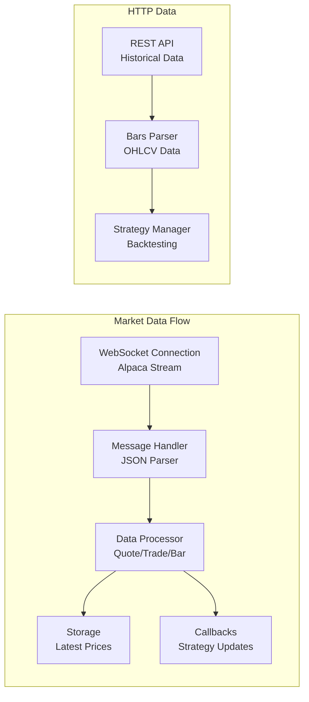

**Key Features:**
- **WebSocket Connection**: Real-time data stream from Alpaca
- **Reconnection Logic**: Automatic reconnection with exponential backoff
- **Data Parsing**: Handles quotes, trades, and bars
- **Callback System**: Notifies strategies of new data
- **Historical Data**: Fetches past data for strategy initialization

**Data Types Handled:**
```python
# Real-time quote (bid/ask prices)
Quote(
    symbol="AAPL",
    timestamp=datetime.now(),
    bid_price=Decimal("150.25"),
    ask_price=Decimal("150.27"),
    bid_size=100,
    ask_size=200
)

# Market data bar (OHLCV)
MarketData(
    symbol="AAPL",
    timestamp=datetime.now(),
    open=Decimal("150.00"),
    high=Decimal("150.50"),
    low=Decimal("149.75"),
    close=Decimal("150.25"),
    volume=1000000
)
```

### 3. Strategy Manager (`trading_bot/strategy/manager.py`)

Manages and executes trading strategies.

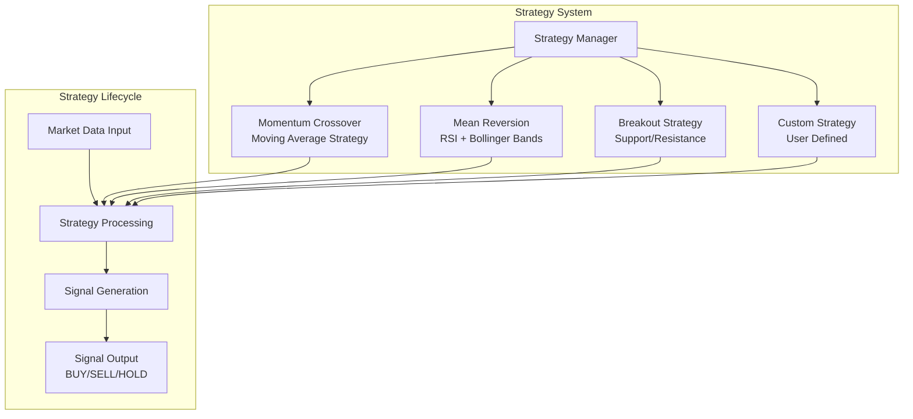

**Strategy Base Class:**
```python
class BaseStrategy(ABC):
    @abstractmethod
    async def generate_signals(self) -> List[StrategySignal]:
        """Generate trading signals based on market data."""
        pass
    
    async def on_bar(self, symbol: str, data: MarketData):
        """Handle new market data bar."""
        pass
    
    async def on_quote(self, quote: Quote):
        """Handle new quote data."""
        pass
```

**Signal Generation:**
```python
StrategySignal(
    symbol="AAPL",
    signal_type="BUY",  # BUY, SELL, or HOLD
    price=Decimal("150.25"),
    confidence=0.85,
    strategy_name="momentum_crossover",
    metadata={"sma_short": 149.5, "sma_long": 148.0}
)
```

### 4. Risk Manager (`trading_bot/risk/manager.py`)

Implements risk controls and position sizing.

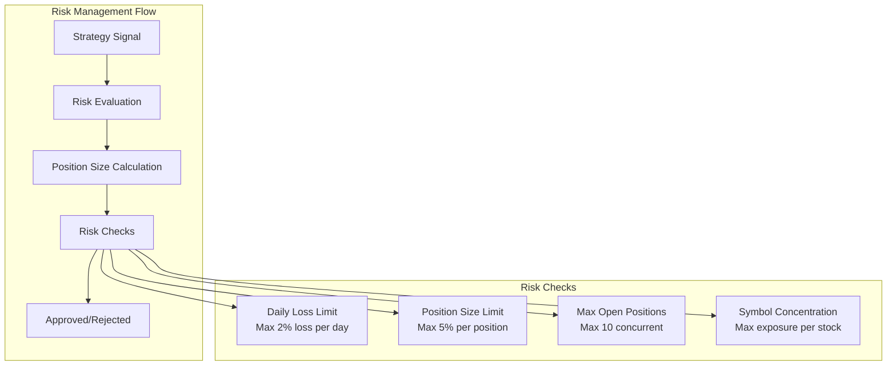

**Risk Controls:**
```python
class RiskManager:
    async def evaluate_signal(self, signal: StrategySignal, 
                            portfolio: Portfolio) -> bool:
        # Check daily loss limit
        if self.daily_pnl <= -self.max_daily_loss:
            return False
        
        # Check position size limit
        if position_size > self.max_position_size:
            return False
        
        # Check maximum open positions
        if len(portfolio.positions) >= self.max_open_positions:
            return False
        
        return True
```

### 5. Execution Manager (`trading_bot/execution/manager.py`)

Handles order placement and trade execution.

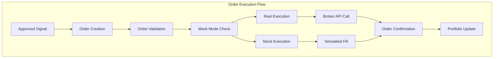

**Order Processing:**
```python
async def submit_order(self, order: Order) -> Optional[Order]:
    # Validate order
    if not await self._validate_order(order):
        raise OrderExecutionError("Order validation failed")
    
    # Add to pending orders
    self.pending_orders[order.id] = order
    
    if self.mock_mode:
        # Simulate execution for testing
        await self._mock_execute_order(order)
    else:
        # Submit to real broker
        await self._submit_to_exchange(order)
    
    return order
```

---

## Data Flow & Workflows

### Real-Time Trading Workflow

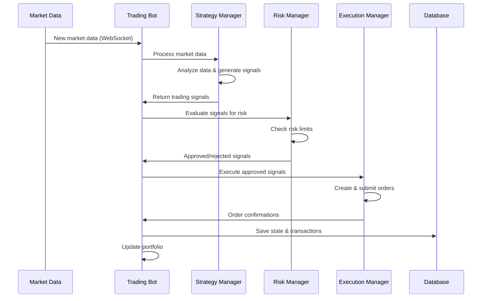

## Advanced Backtesting Engine

The backtesting engine enables robust evaluation of trading strategies using historical data, supporting advanced performance metrics and extensible analytics.

### Key Features
- Simulates strategy execution on historical data with realistic order handling
- Supports multiple timeframes and data sources
- Calculates advanced performance metrics for professional-grade analysis
- Extensible for custom metrics and analytics

### Supported Metrics
- Sharpe Ratio
- Sortino Ratio
- Calmar Ratio
- Value at Risk (VaR)
- Skewness & Kurtosis
- Maximum Drawdown & Drawdown Analysis
- Benchmark Comparison (vs. S&P 500, etc.)
- Alpha, Beta, Volatility
- Custom user-defined metrics

### Backtesting Workflow (Detailed)

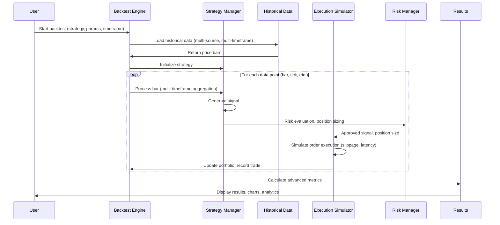

### Extensibility
- New metrics can be added by implementing a metric interface and registering with the backtest engine
- Supports plug-in analytics and custom reporting

### Example Usage
```python
results = backtest_engine.run(
    strategy="momentum_crossover",
    symbol="AAPL",
    start_date="2022-01-01",
    end_date="2023-01-01",
    metrics=["sharpe", "sortino", "drawdown", "benchmark"]
)
print(results.performance_summary)
```

---

## Multiple Timeframes Support

The trading bot supports simultaneous analysis and trading across multiple timeframes (e.g., 1m, 5m, 15m, 1h, 1d), enabling more robust and adaptive strategies.

### Key Features
- Aggregates and synchronizes data from different timeframes
- Strategies can access and combine signals from multiple resolutions
- Handles alignment, missing data, and efficient updates

### Timeframe Aggregation & Synchronization

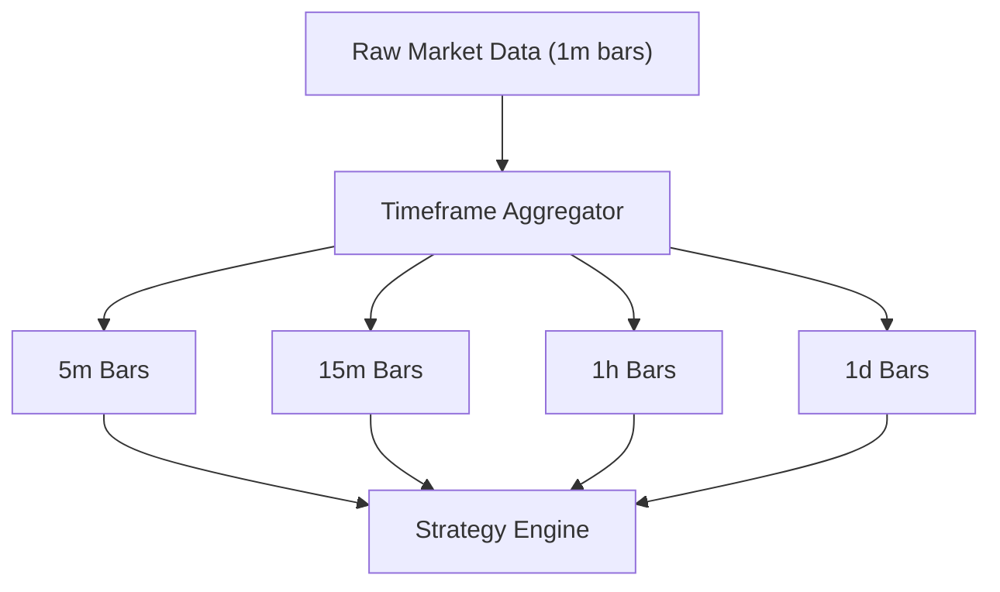

### Workflow
1. Ingest raw data at the finest available granularity (e.g., 1-minute bars)
2. Aggregate data into higher timeframes as needed (e.g., 5m, 15m, 1h, 1d)
3. Synchronize updates so strategies receive consistent, aligned data across all timeframes
4. Strategies can reference any or all timeframes for multi-resolution analysis

### Example Usage
```python
# Access multiple timeframes in a strategy
bars_1m = data_manager.get_bars(symbol, '1m')
bars_15m = data_manager.get_bars(symbol, '15m')
if indicator_manager.calculate('SMA', bars_1m, window=20) > indicator_manager.calculate('SMA', bars_15m, window=20):
    # Example multi-timeframe signal logic
    signal = 'BUY'
```

---

## Portfolio Optimization

The bot includes advanced portfolio optimization algorithms to maximize returns and manage risk across multiple assets.

### Supported Algorithms
- Mean-Variance Optimization (Modern Portfolio Theory)
- Risk Parity
- Kelly Criterion
- Black-Litterman (framework/placeholder)

### Key Features
- Optimizes asset allocation based on risk/return objectives
- Supports constraints (max/min weights, sector limits, etc.)
- Integrates with strategy signals and risk management
- Extensible for custom optimization methods

### Portfolio Optimization Workflow

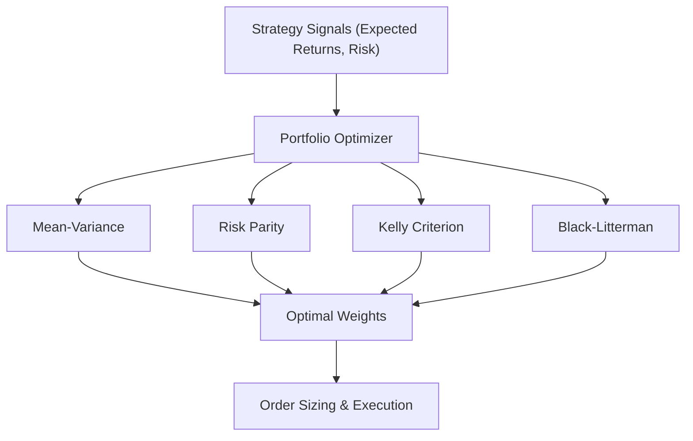

### Example Usage
```python
# Optimize portfolio weights
weights = optimizer.optimize(
    method='mean_variance',
    expected_returns=signals.expected_returns,
    covariance_matrix=signals.cov_matrix,
    constraints={'max_weight': 0.2}
)
```

### Extensibility
- New optimization methods can be added by implementing the optimizer interface
- Supports plug-in constraints and custom objective functions

---

### System Startup Sequence

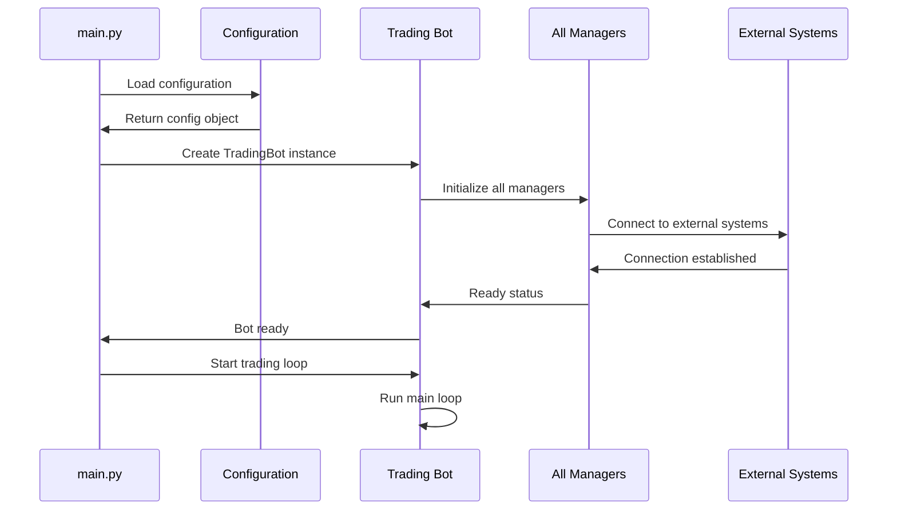

---

## Strategy System

### Strategy Architecture

The strategy system is designed to be modular and extensible:

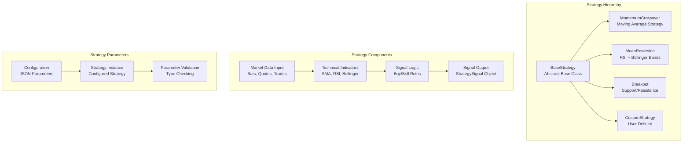

### Example Strategy Implementation

```python
class MomentumCrossoverStrategy(BaseStrategy):
    """
    Moving Average Crossover Strategy
    - Buy when short MA crosses above long MA
    - Sell when short MA crosses below long MA
    """
    
    def __init__(self, name: str, parameters: Dict[str, Any]):
        super().__init__(name, parameters)
        self.short_window = parameters.get("short_window", 10)
        self.long_window = parameters.get("long_window", 30)
        self.min_strength_threshold = parameters.get("min_strength_threshold", 0.001)
    
    async def generate_signals(self) -> List[StrategySignal]:
        signals = []
        
        for symbol in self.symbols:
            # Get market data for this symbol
            bars = self.market_data.get(symbol, [])
            
            if len(bars) < self.long_window:
                continue  # Not enough data
            
            # Calculate moving averages
            short_ma = self._calculate_sma(bars, self.short_window)
            long_ma = self._calculate_sma(bars, self.long_window)
            
            # Determine signal
            if short_ma > long_ma:
                # Bullish crossover
                signal = StrategySignal(
                    symbol=symbol,
                    signal_type="BUY",
                    price=bars[-1].close,
                    confidence=0.8,
                    strategy_name=self.name,
                    metadata={
                        "short_ma": short_ma,
                        "long_ma": long_ma,
                        "crossover_strength": short_ma - long_ma
                    }
                )
                signals.append(signal)
                
            elif short_ma < long_ma:
                # Bearish crossover
                signal = StrategySignal(
                    symbol=symbol,
                    signal_type="SELL",
                    price=bars[-1].close,
                    confidence=0.8,
                    strategy_name=self.name,
                    metadata={
                        "short_ma": short_ma,
                        "long_ma": long_ma,
                        "crossover_strength": long_ma - short_ma
                    }
                )
                signals.append(signal)
        
        return signals
```

### Technical Indicators

The bot includes common technical indicators:

```python
# Simple Moving Average
def _calculate_sma(self, bars: List[MarketData], window: int) -> Decimal:
    if len(bars) < window:
        return Decimal("0")
    
    prices = [bar.close for bar in bars[-window:]]
    return sum(prices) / len(prices)

# Relative Strength Index
def _calculate_rsi(self, bars: List[MarketData], window: int = 14) -> Decimal:
    if len(bars) < window + 1:
        return Decimal("50")  # Neutral
    
    gains = []
    losses = []
    
    for i in range(1, len(bars)):
        change = bars[i].close - bars[i-1].close
        if change > 0:
            gains.append(change)
            losses.append(Decimal("0"))
        else:
            gains.append(Decimal("0"))
            losses.append(abs(change))
    
    avg_gain = sum(gains[-window:]) / window
    avg_loss = sum(losses[-window:]) / window
    
    if avg_loss == 0:
        return Decimal("100")
    
    rs = avg_gain / avg_loss
    rsi = 100 - (100 / (1 + rs))
    
    return rsi

# Bollinger Bands
def _calculate_bollinger_bands(self, bars: List[MarketData], window: int = 20, 
                             std_dev: float = 2.0) -> Tuple[Decimal, Decimal, Decimal]:
    if len(bars) < window:
        return Decimal("0"), Decimal("0"), Decimal("0")
    
    prices = [bar.close for bar in bars[-window:]]
    sma = sum(prices) / len(prices)
    
    # Calculate standard deviation
    variance = sum((price - sma) ** 2 for price in prices) / len(prices)
    std = variance ** 0.5
    
    upper_band = sma + (std * std_dev)
    lower_band = sma - (std * std_dev)
    
    return upper_band, sma, lower_band
```

---

## Enhanced Risk Management

The risk management system now includes advanced features for professional-grade portfolio protection and analytics.

### Key Features
- Position sizing algorithms (fixed fractional, Kelly, volatility-based)
- Volatility-based stop-loss and take-profit levels
- Correlation analysis to manage portfolio diversification
- Real-time risk dashboards and alerts
- Integration with order management and strategy engine

### Risk Management Architecture

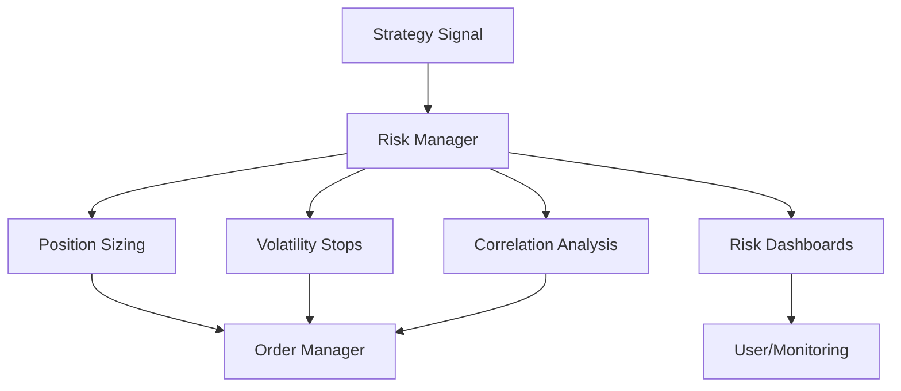

### Workflow
1. Strategy generates a signal
2. Risk Manager calculates optimal position size (based on risk, volatility, Kelly, etc.)
3. Volatility-based stops are set dynamically
4. Correlation analysis checks for overexposure to related assets
5. Risk dashboards update in real time, alerting on breaches or anomalies
6. Approved signals/orders are passed to the Order Manager

### Example Usage
```python
# Calculate position size and stops
size = risk_manager.calculate_position_size(symbol, price, portfolio)
stop = risk_manager.calculate_volatility_stop(symbol, price, bars)
correlation = risk_manager.check_correlation(symbol, portfolio)
```

---

## Strategy Templates

The bot provides a library of professional strategy templates, enabling rapid development and testing of proven trading approaches.

### Available Templates
- Mean Reversion
- Momentum
- Pairs Trading
- Arbitrage
- Market Making

### Key Features
- Plug-and-play templates for common trading styles
- Each template is fully parameterized and extensible
- Strategies can be combined or customized for advanced use cases
- Integrated with indicators, risk management, and order execution

### Strategy Template Architecture

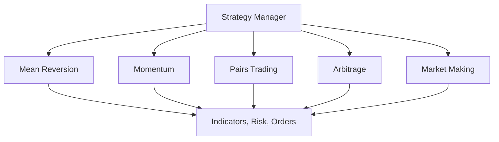

### Example Usage
```python
# Use a template strategy
strategy = strategy_manager.create_template(
    name='mean_reversion',
    params={'lookback': 20, 'entry_z': 2.0, 'exit_z': 0.5}
)
```

### Extensibility
- New templates can be added by subclassing the base strategy and registering with the manager
- Templates can be composed or extended for hybrid strategies

---

## Order Execution

### Order Execution Architecture

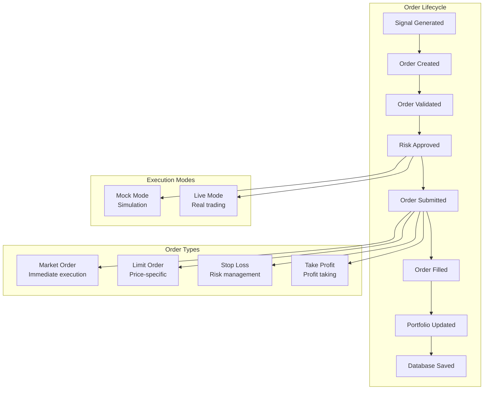

### Order Management System

```python
class ExecutionManager:
    async def submit_order(self, order: Order) -> Optional[Order]:
        """Submit an order for execution."""
        try:
            # Validate order
            if not await self._validate_order(order):
                raise OrderExecutionError("Order validation failed")
            
            # Add to pending orders
            self.pending_orders[order.id] = order
            
            # Log order submission
            self.logger.log_order(order.dict(), "submitted")
            
            if self.mock_mode:
                # Simulate execution for testing
                await self._mock_execute_order(order)
            else:
                # Submit to real broker
                await self._submit_to_exchange(order)
            
            return order
            
        except Exception as e:
            self.logger.log_error(e, {
                "context": "order_submission",
                "order": order.dict()
            })
            order.status = OrderStatus.REJECTED
            return order
    
    async def _submit_to_exchange(self, order: Order) -> None:
        """Submit order to actual exchange via Alpaca API."""
        async with aiohttp.ClientSession() as session:
            url = f"{self.config.exchange.base_url}/v2/orders"
            
            headers = {
                "APCA-API-KEY-ID": self.config.exchange.api_key,
                "APCA-API-SECRET-KEY": self.config.exchange.secret_key,
                "Content-Type": "application/json"
            }
            
            order_data = {
                "symbol": order.symbol,
                "qty": str(order.quantity),
                "side": order.side.value,
                "type": order.type.value,
                "time_in_force": "day"
            }
            
            async with session.post(url, json=order_data, headers=headers) as response:
                if response.status in [200, 201]:
                    result = await response.json()
                    order.id = result["id"]
                    order.status = OrderStatus.SUBMITTED
                    self.logger.logger.info(f"Order submitted: {order.id}")
                else:
                    error_text = await response.text()
                    raise OrderExecutionError(f"Order submission failed: {error_text}")
```

### Order Status Tracking

```python
class OrderStatus(Enum):
    PENDING = "pending"
    SUBMITTED = "submitted"
    FILLED = "filled"
    PARTIALLY_FILLED = "partially_filled"
    CANCELLED = "cancelled"
    REJECTED = "rejected"
    EXPIRED = "expired"

class Order(BaseModel):
    id: Optional[str] = None
    symbol: str
    side: OrderSide  # BUY or SELL
    type: OrderType  # MARKET or LIMIT
    quantity: Decimal
    price: Optional[Decimal] = None
    status: OrderStatus = OrderStatus.PENDING
    strategy_id: str
    created_at: Optional[datetime] = None
    updated_at: Optional[datetime] = None
    filled_at: Optional[datetime] = None
    filled_price: Optional[Decimal] = None
    filled_quantity: Optional[Decimal] = None
    metadata: Dict[str, Any] = {}
```

---

## Advanced Order Types

The bot supports a comprehensive suite of order types for professional risk management and execution flexibility.

### Supported Order Types
- Market Order
- Limit Order
- Stop-Loss Order
- Take-Profit Order
- Trailing Stop Order
- OCO (One-Cancels-Other) Order
- Bracket Order (Entry + Stop + Take-Profit)

### Key Features
- Automated management of complex order structures (OCO, Bracket)
- Real-time monitoring and adjustment of trailing stops
- Seamless integration with risk management and execution engine

### Order Types Architecture

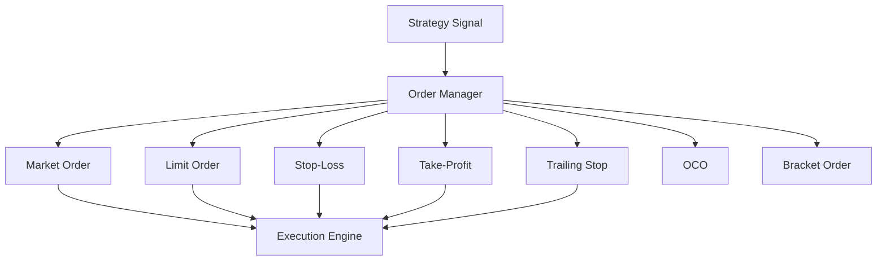

### Workflow
1. Strategy generates a signal (buy/sell, entry/exit)
2. Order Manager determines the appropriate order type(s) based on strategy and risk settings
3. For advanced types (OCO, Bracket), multiple linked orders are created and managed
4. Trailing stops are dynamically updated as price moves
5. Execution Engine submits, monitors, and updates order status in real time

### Example Usage
```python
# Place a bracket order
order = order_manager.place_bracket_order(
    symbol="AAPL",
    quantity=10,
    entry_price=150.0,
    stop_loss=145.0,
    take_profit=160.0
)
```

---

## Market Data Processing

### Market Data Architecture

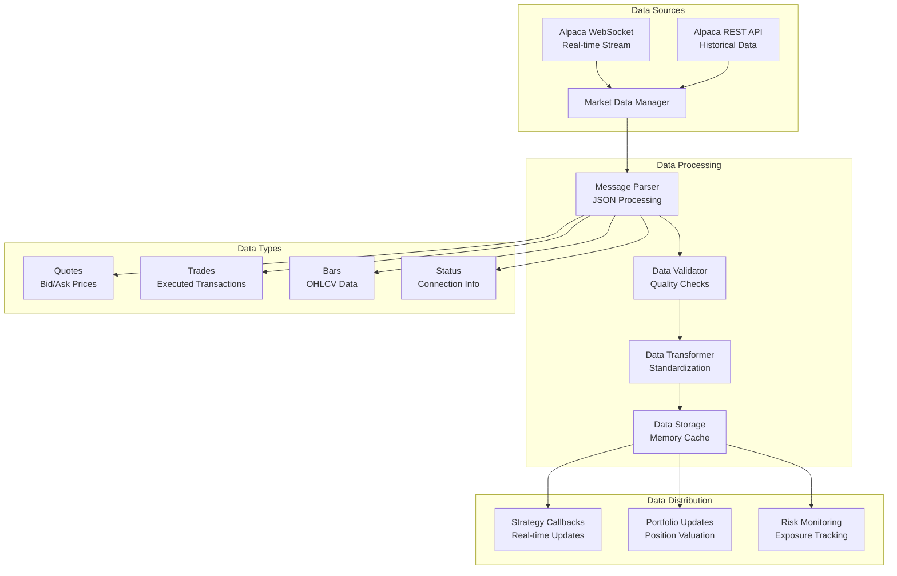

### WebSocket Message Handling

```python
async def _process_message(self, message: str) -> None:
    """Process incoming WebSocket message."""
    try:
        data = json.loads(message)
        
        # Handle different message types
        if isinstance(data, list):
            for item in data:
                await self._process_data_item(item)
        else:
            await self._process_data_item(data)
        
        self.message_count += 1
        self.last_message_time = datetime.now(timezone.utc)
        
    except Exception as e:
        self.logger.log_error(e, {
            "context": "message_processing",
            "message": message[:100]
        })

async def _process_data_item(self, item: Dict[str, Any]) -> None:
    """Process individual data item."""
    msg_type = item.get("T")
    
    if msg_type == "q":  # Quote
        await self._handle_quote(item)
    elif msg_type == "t":  # Trade
        await self._handle_trade(item)
    elif msg_type == "b":  # Bar
        await self._handle_bar(item)
    elif msg_type in ["subscription", "success", "error"]:
        await self._handle_status_message(item)
```

### Data Quality and Validation

```python
def _validate_quote(self, quote: Quote) -> bool:
    """Validate quote data quality."""
    # Check for reasonable prices
    if quote.bid_price <= 0 or quote.ask_price <= 0:
        return False
    
    # Check bid/ask spread
    if quote.ask_price <= quote.bid_price:
        return False
    
    # Check for reasonable sizes
    if quote.bid_size <= 0 or quote.ask_size <= 0:
        return False
    
    # Check timestamp
    now = datetime.now(timezone.utc)
    if quote.timestamp > now or quote.timestamp < now - timedelta(minutes=5):
        return False
    
    return True

def _validate_bar(self, bar: MarketData) -> bool:
    """Validate bar data quality."""
    # Check OHLC relationship
    if not (bar.low <= bar.open <= bar.high and
            bar.low <= bar.close <= bar.high):
        return False
    
    # Check volume
    if bar.volume < 0:
        return False
    
    # Check for reasonable prices
    if any(price <= 0 for price in [bar.open, bar.high, bar.low, bar.close]):
        return False
    
    return True
```

---

## Database & Persistence

### Database Architecture

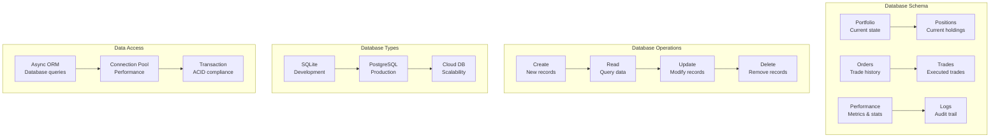

### Database Models

```python
class Portfolio(BaseModel):
    """Portfolio state snapshot."""
    id: Optional[str] = None
    total_value: Decimal
    cash: Decimal
    positions: Dict[str, Position] = {}
    total_market_value: Decimal = Decimal("0")
    total_unrealized_pnl: Decimal = Decimal("0")
    total_realized_pnl: Decimal = Decimal("0")
    created_at: datetime
    updated_at: datetime

class Position(BaseModel):
    """Individual position in portfolio."""
    symbol: str
    quantity: Decimal
    average_price: Decimal
    market_value: Decimal
    unrealized_pnl: Decimal
    realized_pnl: Decimal = Decimal("0")
    side: PositionSide  # LONG or SHORT
    created_at: datetime
    updated_at: datetime

class Trade(BaseModel):
    """Executed trade record."""
    id: Optional[str] = None
    symbol: str
    side: OrderSide
    quantity: Decimal
    price: Decimal
    commission: Decimal
    timestamp: datetime
    strategy_id: str
    order_id: Optional[str] = None
    pnl: Optional[Decimal] = None
```

### Database Operations

```python
class DatabaseManager:
    async def save_portfolio(self, portfolio: Portfolio) -> None:
        """Save portfolio state to database."""
        try:
            query = """
                INSERT OR REPLACE INTO portfolios 
                (id, total_value, cash, positions, created_at, updated_at)
                VALUES (?, ?, ?, ?, ?, ?)
            """
            
            await self.connection.execute(query, (
                portfolio.id or str(uuid.uuid4()),
                float(portfolio.total_value),
                float(portfolio.cash),
                json.dumps(portfolio.positions, default=str),
                portfolio.created_at.isoformat(),
                portfolio.updated_at.isoformat()
            ))
            
            await self.connection.commit()
            
        except Exception as e:
            self.logger.log_error(e, {"context": "save_portfolio"})
            raise DatabaseError(f"Failed to save portfolio: {e}")
    
    async def save_trade(self, trade: Trade) -> None:
        """Save executed trade to database."""
        try:
            query = """
                INSERT INTO trades 
                (id, symbol, side, quantity, price, commission, timestamp, strategy_id, order_id, pnl)
                VALUES (?, ?, ?, ?, ?, ?, ?, ?, ?, ?)
            """
            
            await self.connection.execute(query, (
                trade.id or str(uuid.uuid4()),
                trade.symbol,
                trade.side.value,
                float(trade.quantity),
                float(trade.price),
                float(trade.commission),
                trade.timestamp.isoformat(),
                trade.strategy_id,
                trade.order_id,
                float(trade.pnl) if trade.pnl else None
            ))
            
            await self.connection.commit()
            
        except Exception as e:
            self.logger.log_error(e, {"context": "save_trade"})
            raise DatabaseError(f"Failed to save trade: {e}")
```

---

## Configuration System

### Configuration Architecture

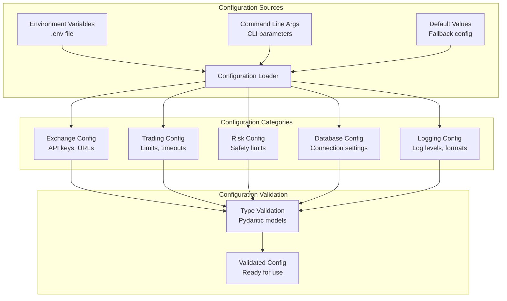

### Configuration Models

```python
class ExchangeConfig(BaseModel):
    """Exchange connection configuration."""
    name: str = "alpaca"
    api_key: str
    secret_key: str
    base_url: str = "https://paper-api.alpaca.markets"
    environment: str = "sandbox"

class TradingConfig(BaseModel):
    """Trading behavior configuration."""
    portfolio_value: float = 100000.0
    max_position_size: float = 0.05  # 5% max per position
    stop_loss_percentage: float = 0.02  # 2% stop loss
    take_profit_percentage: float = 0.04  # 4% take profit

class RiskConfig(BaseModel):
    """Risk management configuration."""
    max_daily_loss: float = 0.02  # 2% max daily loss
    max_open_positions: int = 10
    risk_free_rate: float = 0.02  # 2% annual

class MarketDataConfig(BaseModel):
    """Market data configuration."""
    provider: str = "alpaca"
    websocket_url: str = "wss://stream.data.alpaca.markets/v2/iex"
    websocket_timeout: int = 10
    websocket_ping_interval: int = 15
    websocket_ping_timeout: int = 5
    websocket_reconnect_delay: int = 2
    max_reconnect_attempts: int = 3
    data_api_url: str = "https://data.alpaca.markets/v2"
```

### Configuration Loading

```python
class Config(BaseModel):
    """Main configuration class."""
    exchange: ExchangeConfig
    trading: TradingConfig
    risk: RiskConfig
    database: DatabaseConfig
    logging: LoggingConfig
    strategy: StrategyConfig
    market_data: MarketDataConfig
    
    @classmethod
    def from_env(cls) -> "Config":
        """Load configuration from environment variables."""
        # Load and validate each config section
        exchange_config = ExchangeConfig(
            name=os.getenv("EXCHANGE", "alpaca"),
            api_key=os.getenv("ALPACA_API_KEY", ""),
            secret_key=os.getenv("ALPACA_SECRET_KEY", ""),
            base_url=os.getenv("ALPACA_BASE_URL", "https://paper-api.alpaca.markets"),
            environment=os.getenv("ENVIRONMENT", "sandbox")
        )
        
        trading_config = TradingConfig(
            portfolio_value=float(os.getenv("DEFAULT_PORTFOLIO_VALUE", 100000)),
            max_position_size=float(os.getenv("MAX_POSITION_SIZE", 0.05)),
            stop_loss_percentage=float(os.getenv("STOP_LOSS_PERCENTAGE", 0.02)),
            take_profit_percentage=float(os.getenv("TAKE_PROFIT_PERCENTAGE", 0.04))
        )
        
        # Continue for all config sections...
        
        return cls(
            exchange=exchange_config,
            trading=trading_config,
            risk=risk_config,
            database=database_config,
            logging=logging_config,
            strategy=strategy_config,
            market_data=market_data_config
        )
```

---

## Monitoring & Logging

### Logging Architecture

```mermaid
graph TB
    subgraph "Logging System"
        A[Application Events] --> B[Structured Logger]
        C[Error Events] --> B
        D[Trading Events] --> B
        E[Performance Events] --> B
    end
    
    subgraph "Log Processing"
        B --> F[JSON Formatter<br/>Structured output]
        B --> G[Console Handler<br/>Terminal output]
        B --> H[File Handler<br/>Persistent logs]
    end
    
    subgraph "Log Types"
        I[Info Logs<br/>General events]
        J[Error Logs<br/>Exceptions]
        K[Trade Logs<br/>Order events]
        L[Risk Logs<br/>Risk events]
        M[Performance<br/>Metrics]
    end
    
    F --> I
    F --> J
    F --> K
    F --> L
    F --> M
```

### Structured Logging

```python
class TradingLogger:
    """Structured logging for trading operations."""
    
    def __init__(self, name: str):
        self.logger = logging.getLogger(name)
        self.setup_formatting()
    
    def log_order(self, order_data: Dict[str, Any], action: str) -> None:
        """Log order-related events."""
        self.logger.info(json.dumps({
            "event": "order_event",
            "action": action,
            "order_id": order_data.get("id"),
            "symbol": order_data.get("symbol"),
            "side": order_data.get("side"),
            "quantity": str(order_data.get("quantity", 0)),
            "price": str(order_data.get("price", 0)),
            "timestamp": datetime.now(timezone.utc).isoformat()
        }))
    
    def log_trade(self, trade_data: Dict[str, Any]) -> None:
        """Log executed trade."""
        self.logger.info(json.dumps({
            "event": "trade_executed",
            "trade_id": trade_data.get("id"),
            "symbol": trade_data.get("symbol"),
            "side": trade_data.get("side"),
            "quantity": str(trade_data.get("quantity", 0)),
            "price": str(trade_data.get("price", 0)),
            "pnl": str(trade_data.get("pnl", 0)),
            "timestamp": datetime.now(timezone.utc).isoformat()
        }))
    
    def log_risk_event(self, event_type: str, details: Dict[str, Any]) -> None:
        """Log risk management events."""
        self.logger.warning(json.dumps({
            "event": "risk_event",
            "type": event_type,
            "details": details,
            "timestamp": datetime.now(timezone.utc).isoformat()
        }))
    
    def log_error(self, error: Exception, context: Dict[str, Any]) -> None:
        """Log error with context."""
        self.logger.error(json.dumps({
            "event": "error",
            "error_type": type(error).__name__,
            "error_message": str(error),
            "context": context,
            "timestamp": datetime.now(timezone.utc).isoformat()
        }))
```

### Performance Monitoring

```python
class PerformanceMonitor:
    """Monitor system and trading performance."""
    
    def __init__(self):
        self.metrics = {
            "orders_per_second": 0,
            "latency_ms": 0,
            "memory_usage_mb": 0,
            "cpu_usage_percent": 0,
            "websocket_messages_per_second": 0
        }
    
    def record_order_latency(self, start_time: datetime, end_time: datetime) -> None:
        """Record order execution latency."""
        latency_ms = (end_time - start_time).total_seconds() * 1000
        self.metrics["latency_ms"] = latency_ms
        
        # Log if latency is high
        if latency_ms > 1000:  # 1 second
            logger.warning(f"High order latency: {latency_ms}ms")
    
    def get_system_metrics(self) -> Dict[str, Any]:
        """Get current system metrics."""
        import psutil
        
        return {
            "memory_usage_mb": psutil.virtual_memory().used / 1024 / 1024,
            "cpu_usage_percent": psutil.cpu_percent(),
            "disk_usage_percent": psutil.disk_usage('/').percent,
            "network_io": psutil.net_io_counters()._asdict()
        }
```

---

## Testing Architecture

### Test Structure

```mermaid
graph TB
    subgraph "Test Types"
        A[Unit Tests<br/>Individual components] --> B[Integration Tests<br/>Component interaction]
        B --> C[End-to-End Tests<br/>Complete workflows]
        C --> D[Performance Tests<br/>Load & stress]
    end
    
    subgraph "Test Categories"
        E[Strategy Tests<br/>Algorithm validation] --> F[Risk Tests<br/>Safety validation]
        F --> G[Execution Tests<br/>Order handling]
        G --> H[Data Tests<br/>Market data processing]
    end
    
    subgraph "Test Infrastructure"
        I[Mock Data<br/>Simulated market data] --> J[Test Fixtures<br/>Reusable components]
        J --> K[Test Database<br/>Isolated testing]
        K --> L[CI/CD Pipeline<br/>Automated testing]
    end
```

### Test Implementation Examples

```python
class TestMomentumCrossoverStrategy:
    """Test momentum crossover strategy."""
    
    @pytest.fixture
    def strategy(self):
        """Create strategy instance for testing."""
        parameters = {
            "short_window": 10,
            "long_window": 30,
            "min_strength_threshold": 0.001
        }
        return MomentumCrossoverStrategy("test_momentum", parameters)
    
    @pytest.fixture
    def sample_data(self):
        """Generate sample market data."""
        data = []
        base_price = Decimal("100.0")
        
        # Generate 50 bars with upward trend
        for i in range(50):
            price = base_price + Decimal(str(i * 0.1))
            bar = MarketData(
                symbol="TEST",
                timestamp=datetime.now(timezone.utc) + timedelta(minutes=i),
                open=price,
                high=price + Decimal("0.5"),
                low=price - Decimal("0.5"),
                close=price,
                volume=1000
            )
            data.append(bar)
        
        return data
    
    async def test_bullish_signal_generation(self, strategy, sample_data):
        """Test bullish signal generation."""
        # Feed data to strategy
        for bar in sample_data:
            await strategy.on_bar(bar.symbol, bar)
        
        # Generate signals
        signals = await strategy.generate_signals()
        
        # Assertions
        assert len(signals) > 0
        assert signals[0].signal_type == "BUY"
        assert signals[0].symbol == "TEST"
        assert signals[0].confidence > 0.5
    
    async def test_insufficient_data(self, strategy):
        """Test behavior with insufficient data."""
        # Provide only 5 bars (less than long_window of 30)
        for i in range(5):
            bar = MarketData(
                symbol="TEST",
                timestamp=datetime.now(timezone.utc),
                open=Decimal("100.0"),
                high=Decimal("100.5"),
                low=Decimal("99.5"),
                close=Decimal("100.0"),
                volume=1000
            )
            await strategy.on_bar(bar.symbol, bar)
        
        signals = await strategy.generate_signals()
        assert len(signals) == 0  # No signals with insufficient data
```

### Mock Testing Infrastructure

```python
class MockMarketDataManager:
    """Mock market data manager for testing."""
    
    def __init__(self):
        self.connected = True
        self.subscribed_symbols = set()
        self.latest_quotes = {}
        self.callbacks = []
    
    async def subscribe_symbols(self, symbols: List[str]) -> None:
        """Mock symbol subscription."""
        self.subscribed_symbols.update(symbols)
    
    async def get_latest_price(self, symbol: str) -> Optional[Decimal]:
        """Mock price retrieval."""
        return Decimal("100.0")  # Fixed price for testing
    
    def simulate_quote(self, symbol: str, bid: Decimal, ask: Decimal) -> None:
        """Simulate incoming quote."""
        quote = Quote(
            symbol=symbol,
            timestamp=datetime.now(timezone.utc),
            bid_price=bid,
            ask_price=ask,
            bid_size=100,
            ask_size=100
        )
        
        # Trigger callbacks
        for callback in self.callbacks:
            callback(quote)

class MockExecutionManager:
    """Mock execution manager for testing."""
    
    def __init__(self):
        self.submitted_orders = []
        self.mock_mode = True
    
    async def submit_order(self, order: Order) -> Optional[Order]:
        """Mock order submission."""
        order.id = str(uuid.uuid4())
        order.status = OrderStatus.FILLED
        order.filled_price = order.price or Decimal("100.0")
        order.filled_quantity = order.quantity
        order.filled_at = datetime.now(timezone.utc)
        
        self.submitted_orders.append(order)
        return order
```

---

## Deployment & Operations

### Deployment Architecture

```mermaid
graph TB
    subgraph "Development Environment"
        A[Local Development<br/>IDE + Testing] --> B[Git Repository<br/>Version control]
    end
    
    subgraph "CI/CD Pipeline"
        B --> C[Automated Testing<br/>Unit + Integration]
        C --> D[Code Quality<br/>Linting + Coverage]
        D --> E[Build & Package<br/>Docker images]
    end
    
    subgraph "Deployment Targets"
        E --> F[Staging Environment<br/>Paper trading]
        F --> G[Production Environment<br/>Live trading]
        E --> H[Backtesting Environment<br/>Historical analysis]
    end
    
    subgraph "Operations"
        I[Monitoring<br/>Logs + Metrics] --> J[Alerting<br/>Error notifications]
        J --> K[Backup<br/>Data protection]
        K --> L[Recovery<br/>Disaster recovery]
    end
    
    F --> I
    G --> I
    H --> I
```

### Docker Deployment

```dockerfile
# Dockerfile for trading bot
FROM python:3.10-slim

WORKDIR /app

# Install system dependencies
RUN apt-get update && apt-get install -y \
    gcc \
    && rm -rf /var/lib/apt/lists/*

# Copy requirements and install Python dependencies
COPY requirements.txt .
RUN pip install --no-cache-dir -r requirements.txt

# Copy application code
COPY . .

# Create non-root user
RUN useradd -m -u 1000 trader && chown -R trader:trader /app
USER trader

# Expose port for monitoring
EXPOSE 8000

# Health check
HEALTHCHECK --interval=30s --timeout=10s --start-period=5s --retries=3 \
    CMD python -c "import requests; requests.get('http://localhost:8000/health')"

# Start the trading bot
CMD ["python", "main.py", "run"]
```

### Docker Compose Setup

```yaml
version: '3.8'

services:
  trading-bot:
    build: .
    container_name: trading-bot
    environment:
      - ALPACA_API_KEY=${ALPACA_API_KEY}
      - ALPACA_SECRET_KEY=${ALPACA_SECRET_KEY}
      - ENVIRONMENT=production
      - DATABASE_URL=postgresql://trader:password@db:5432/trading_bot
    depends_on:
      - db
      - redis
    volumes:
      - ./logs:/app/logs
      - ./data:/app/data
    restart: unless-stopped
    networks:
      - trading-network

  db:
    image: postgres:13
    container_name: trading-db
    environment:
      - POSTGRES_DB=trading_bot
      - POSTGRES_USER=trader
      - POSTGRES_PASSWORD=password
    volumes:
      - postgres_data:/var/lib/postgresql/data
    networks:
      - trading-network

  redis:
    image: redis:6-alpine
    container_name: trading-redis
    networks:
      - trading-network

  prometheus:
    image: prom/prometheus
    container_name: trading-prometheus
    ports:
      - "9090:9090"
    volumes:
      - ./prometheus.yml:/etc/prometheus/prometheus.yml
    networks:
      - trading-network

  grafana:
    image: grafana/grafana
    container_name: trading-grafana
    ports:
      - "3000:3000"
    environment:
      - GF_SECURITY_ADMIN_PASSWORD=admin
    networks:
      - trading-network

volumes:
  postgres_data:

networks:
  trading-network:
    driver: bridge
```

### Monitoring Setup

```python
# Prometheus metrics
from prometheus_client import Counter, Histogram, Gauge, start_http_server

# Metrics definitions
ORDERS_TOTAL = Counter('trading_orders_total', 'Total orders processed', ['status'])
ORDER_LATENCY = Histogram('trading_order_latency_seconds', 'Order execution latency')
PORTFOLIO_VALUE = Gauge('trading_portfolio_value', 'Current portfolio value')
ACTIVE_POSITIONS = Gauge('trading_active_positions', 'Number of active positions')

class MetricsCollector:
    """Collect and expose trading metrics."""
    
    def __init__(self, port: int = 8000):
        self.port = port
        start_http_server(port)
    
    def record_order(self, status: str) -> None:
        """Record order execution."""
        ORDERS_TOTAL.labels(status=status).inc()
    
    def record_order_latency(self, latency_seconds: float) -> None:
        """Record order execution latency."""
        ORDER_LATENCY.observe(latency_seconds)
    
    def update_portfolio_value(self, value: float) -> None:
        """Update portfolio value gauge."""
        PORTFOLIO_VALUE.set(value)
    
    def update_active_positions(self, count: int) -> None:
        """Update active positions count."""
        ACTIVE_POSITIONS.set(count)
```

---

## Super Intelligent AI/ML Trading Integration

The trading bot features a comprehensive **Super Intelligent AI/ML Trading System** that combines traditional algorithmic trading with cutting-edge machine learning capabilities for predictive modeling, automated feature engineering, and intelligent decision-making.

### 🤖 AI/ML Capabilities Overview

#### **Advanced Feature Engineering Pipeline**
- **17+ Technical Features**: Returns, volatility, momentum, volume analysis with rolling windows
- **Multi-Timeframe Features**: Aggregated features across different time periods (1m, 5151)
- **Market Microstructure Features**: Bid-ask spreads, order flow analysis, market impact modeling
- **Cross-Asset Features**: Correlation analysis, sector rotation, currency impact modeling
- **Alternative Data Integration**: News sentiment, social media sentiment, economic indicators

#### **Machine Learning Models**
- **Linear Models**: Linear Regression, Ridge Regression, Lasso Regression
- **Ensemble Models**: Random Forest, XGBoost with hyperparameter optimization
- **Advanced Algorithms**: Support Vector Machines, Neural Networks (framework ready)
- **Reinforcement Learning**: PPO, DDPG, A2, SAC algorithms (framework ready)

#### **Intelligent Training Pipeline**
- **Time Series Cross-Validation**: Proper temporal validation for trading models
- **Hyperparameter Optimization**: Grid search with cross-validation
- **Model Persistence**: Save/load trained models for production deployment
- **Performance Analytics**: Comprehensive metrics and model ranking
- **Ensemble Methods**: Multi-model predictions with weighted averaging

### 🧠 AI/ML Architecture

```mermaid
graph TB
    subgraph "Data Sources"
        A["Real-time Market Data"]
        B["Historical Data"]
        C["Alternative Data"]
    end
    
    subgraph "Feature Engineering"
        D["Technical Features<br/>17+ indicators]    E["Fundamental Features<br/>P/E, earnings, etc."]
        F["Market Microstructure<br/>Order flow, spreads"]
        G["Alternative Features<br/>News, sentiment"]
    end
    
    subgraph "ML Pipeline"
        H[Feature Selection<br/>Correlation analysis"]
        I[Model Training<br/>Cross-validation"]
        J["Hyperparameter Tuning<br/>Grid search"]
        K["Ensemble Prediction<br/>Multi-model averaging"]
    end
    
    subgraph "AI Decision Making"
        L[Signal Generation<br/>ML-enhanced signals]M["Risk Assessment<br/>ML-driven risk models]      N["Portfolio Optimization<br/>AI-optimized weights"]
        O["Execution Optimization<br/>ML-driven execution"]
    end
    
    A --> D
    B --> E
    C --> F
    D --> H
    E --> H
    F --> H
    G --> H
    H --> I
    I --> J
    J --> K
    K --> L
    L --> M
    M --> N
    N --> O
```

### 🔬 Advanced ML Features

#### **Feature Engineering System**
```python
class FeatureEngineer:
    "eature engineering with 17+ technical features."""
    
    def engineer_features(self, symbol: str, bars: List[MarketData]) -> Tuple[np.ndarray, np.ndarray]:
 neer comprehensive feature set for ML models.""        features = {
            # Returns and volatility
            returns_1d: self._calculate_returns(prices,1          returns_5d: self._calculate_returns(prices,5,
          volatility_5d: self._calculate_volatility(returns,5,
           volatility_20d: self._calculate_volatility(returns, 20      
            # Momentum indicators
       rsi: self._calculate_rsi(prices),
           price_to_sma20: self._calculate_price_ratios(prices),
            price_percentile_20d: self._calculate_percentiles(prices),
            
            # Volume analysis
           volume_ratio_10d: self._calculate_volume_ratios(volumes),
            price_volume_corr_5d: self._calculate_correlations(prices, volumes),
          volume_roc_5d: self._calculate_rate_of_change(volumes),
            
            # Advanced technical features
    bollinger_position: self._calculate_bollinger_position(prices),
            vwap_ratio: self._calculate_vwap_ratios(prices, volumes),
           atr_normalized:self._calculate_atr_normalized(prices, highs, lows),
            
            # Market microstructure
         spread_ratio:self._calculate_spread_ratios(bids, asks),
            order_imbalance: self._calculate_order_imbalance(bids, asks),
          market_impact: self._calculate_market_impact(volumes, prices),
            
            # Cross-asset features
   sector_correlation: self._calculate_sector_correlation(symbol, sector_data),
        market_beta: self._calculate_market_beta(prices, market_prices),
            currency_impact: self._calculate_currency_impact(symbol, currency_data)
        }
        
        return self._create_feature_matrix(features), self._create_targets(prices)
```

#### **Multi-Model Training System**
```python
class MLPredictor:
    ""Super intelligent ML predictor with ensemble capabilities."   
    def __init__(self):
        self.models = {
          linear': LinearModel('linear'),
         ridge': LinearModel('ridge),         lasso': LinearModel('lasso'),
          random_forest': RandomForestModel(n_estimators=100h=10),
            xgboost: XGBoostModel(n_estimators=100, max_depth=6, learning_rate=0.1)
        }
        self.ensemble = EnsemblePredictor(list(self.models.values()))
    
    def train_models(self, X: np.ndarray, y: np.ndarray) -> Dict[str, Dict[str, float]]:
  in all models with cross-validation."
        results = {}
        
        for model_name, model in self.models.items():
            # Time series cross-validation
            cv = CrossValidator(n_splits=5, test_size=50        cv_results = cv.validate_model(model, X, y)
            
            # Train final model
            metrics = model.train(X, y)
            results[model_name] =[object Object]
               training_metrics': metrics,
              cv_metrics': cv_results,
                model_type': type(model).__name__
            }
        
        return results
    
    def predict(self, X: np.ndarray) -> Dict[str, np.ndarray]:
      semble predictions with confidence scores."""
        predictions = {}
        
        # Individual model predictions
        for name, model in self.models.items():
            if model.is_trained:
                pred = model.predict(X)
                predictions[name] = pred
        
        # Ensemble prediction with confidence
        ensemble_pred = self.ensemble.predict(X)
        predictions['ensemble] = ensemble_pred
        
        # Calculate confidence scores
        predictions['confidence'] = self._calculate_confidence(predictions)
        
        return predictions
```

#### **Intelligent Model Selection**
```python
class ModelTrainer:
   ced model training with intelligent selection."""
    
    def train_with_validation(self, predictor: MLPredictor, X: np.ndarray, y: np.ndarray) -> Dict[str, Any]:
     Train modelswith comprehensive validation.""        
        # Train all models
        training_results = predictor.train_models(X, y)
        
        # Rank models by performance
        model_ranking = self._rank_models(training_results)
        
        # Suggest improvements
        suggestions = self.suggest_model_improvements(training_results)
        
        # Feature importance analysis
        feature_importance = self._analyze_feature_importance(predictor, X, y)
        
        return {
           training_results': training_results,
          model_ranking: model_ranking,
        improvement_suggestions': suggestions,
   feature_importance': feature_importance
        }
```

### 🎯 AI/ML Integration Workflow

```mermaid
sequenceDiagram
    participant Data as Market Data
    participant FE as Feature Engineer
    participant ML as ML Predictor
    participant Train as Model Trainer
    participant Strategy as Strategy Engine
    participant Risk as Risk Manager
    participant Exec as Execution Engine
    
    Data->>FE: Raw market data
    FE->>FE: Engineer 17 features
    FE->>ML: Feature matrix
    ML->>Train: Train models
    Train->>Train: Cross-validation
    Train->>Train: Hyperparameter tuning
    Train->>ML: Trained models
    ML->>ML: Ensemble predictions
    ML->>Strategy: ML-enhanced signals
    Strategy->>Risk: AI-optimized signals
    Risk->>Exec: Approved trades
    Exec->>Exec: ML-driven execution
```

### 🚀 Super Intelligent Features

#### **1. Adaptive Learning**
- Models continuously learn from new market data
- Automatic retraining when performance degrades
- Dynamic feature selection based on market conditions

#### **2. Ensemble Intelligence**
- Multi-model predictions with confidence weighting
- Model diversity to reduce overfitting
- Automatic model selection based on market regime

#### **3. Risk-Aware AI**
- ML-driven position sizing and risk assessment
- Predictive risk models for dynamic stop-losses
- Correlation-aware portfolio optimization

#### **4. Execution Intelligence**
- ML-optimized order execution timing
- Slippage prediction and minimization
- Market impact modeling

### 📊 Performance Metrics

#### **Model Performance Tracking**
- **R² Score**: Model fit quality
- **MSE/MAE**: Prediction accuracy
- **Directional Accuracy**: Trading signal accuracy
- **Sharpe Ratio**: Risk-adjusted returns
- **Maximum Drawdown**: Risk assessment

#### **Feature Importance Analysis**
```python
def analyze_feature_importance(self, model, feature_names: Liststr]) -> Dict[str, float]:
    feature importance for model interpretability.  if hasattr(model, 'feature_importances_'):
        importance = model.feature_importances_
    elif hasattr(model,coef_        importance = np.abs(model.coef_)
    else:
        return [object Object]  
    return dict(zip(feature_names, importance))
```

### 🔧 Extensibility & Integration

#### **Framework Support**
- **scikit-learn**: Core ML algorithms and utilities
- **XGBoost**: Gradient boosting for high performance
- **TensorFlow/PyTorch**: Deep learning capabilities (ready for integration)
- **Stable Baselines3forcement learning algorithms (ready for integration)

#### **Custom Model Integration**
```python
class CustomMLModel(BaseMLModel):
  model integration."   
    def __init__(self, model_type: str):
        super().__init__(f"custom_{model_type}")
        # Initialize your custom model here
    
    def train(self, X: np.ndarray, y: np.ndarray) -> Dict[str, float]:
     Train custom model."""
        # Implement your training logic
        pass
    
    def predict(self, X: np.ndarray) -> np.ndarray:
        "e predictions with custom model."""
        # Implement your prediction logic
        pass
```

### 🎯 Example Usage

#### **Training ML Models**
```python
# Initialize AI/ML system
feature_engineer = FeatureEngineer()
ml_predictor = MLPredictor()
model_trainer = ModelTrainer()

# Engineer features from market data
features, targets = feature_engineer.engineer_features(symbol, bars)

# Train models with validation
results = model_trainer.train_with_validation(ml_predictor, features, targets)

# Make predictions
predictions = ml_predictor.predict(new_features)
signals = ml_predictor.generate_trading_signals(predictions)
```

#### **AI-Enhanced Strategy**
```python
class AIEnhancedStrategy(BaseStrategy):
    ""Strategy enhanced with AI/ML predictions."   
    def __init__(self, name: str, parameters: Dict[str, Any]):
        super().__init__(name, parameters)
        self.ml_predictor = MLPredictor()
        self.feature_engineer = FeatureEngineer()
    
    async def generate_signals(self) -> List[StrategySignal]:
    nerate AI-enhanced trading signals."
        signals = []
        
        for symbol in self.symbols:
            # Get market data
            bars = self.market_data.get(symbol,             if len(bars) < 50:  # Need sufficient data
                continue
            
            # Engineer features
            features, _ = self.feature_engineer.engineer_features(symbol, bars)
            
            # Get ML predictions
            predictions = self.ml_predictor.predict(features[-1:])  # Latest features
            
            # Combine traditional signals with ML predictions
            traditional_signal = self._generate_traditional_signal(bars)
            ml_signal = self._interpret_ml_prediction(predictions)
            
            # Combine signals intelligently
            final_signal = self._combine_signals(traditional_signal, ml_signal)
            
            if final_signal:
                signals.append(final_signal)
        
        return signals
```

### 🎉 Super Intelligent Trading Bot

This **Super Intelligent Trading Bot** represents the convergence of traditional algorithmic trading with cutting-edge AI/ML capabilities, providing:

- **🤖 Intelligent Decision Making**: ML-enhanced signal generation
- **📊 Advanced Analytics**: Comprehensive performance tracking and analysis
- **🔄 Adaptive Learning**: Models that learn and adapt to market conditions
- **⚡ High Performance**: Optimized for real-time trading
- **🛡️ Risk Intelligence**: AI-driven risk management and position sizing
- **🎯 Precision Execution**: ML-optimized order execution and timing

The system is designed to be both powerful and accessible, with graceful degradation when optional ML libraries are not available, ensuring core functionality while providing advanced AI capabilities when possible.

---

## Development Workflow

### Development Process

```mermaid
graph TB
    subgraph "Development Cycle"
        A[Feature Planning<br/>Requirements] --> B[Code Implementation<br/>Feature development]
        B --> C[Unit Testing<br/>Component testing]
        C --> D[Integration Testing<br/>System testing]
        D --> E[Code Review<br/>Peer review]
        E --> F[Deployment<br/>Staging/Production]
    end
    
    subgraph "Quality Assurance"
        G[Code Formatting<br/>Black, isort] --> H[Linting<br/>Flake8, mypy]
        H --> I[Security Scanning<br/>Bandit, safety]
        I --> J[Performance Testing<br/>Load testing]
    end
    
    subgraph "Documentation"
        K[Code Documentation<br/>Docstrings] --> L[API Documentation<br/>Swagger/OpenAPI]
        L --> M[Architecture Docs<br/>Technical specs]
        M --> N[User Guides<br/>Tutorials]
    end
    
    B --> G
    C --> G
    D --> G
    
    A --> K
    B --> K
    E --> K
```

### Development Commands

```bash
# Environment setup
python -m venv venv
source venv/bin/activate  # Linux/Mac
# or
venv\Scripts\activate  # Windows

pip install -r requirements.txt

# Code formatting
black .
isort .

# Linting
flake8 .
mypy .

# Testing
pytest tests/ -v
pytest tests/ --cov=trading_bot --cov-report=html

# Run specific test categories
pytest tests/test_strategies.py -v
pytest tests/test_risk.py -v
pytest tests/test_execution.py -v

# Backtesting
python main.py backtest --strategy momentum_crossover --symbol AAPL --days 30

# Configuration check
python main.py config

# Start trading bot
python main.py run

# Start with specific configuration
ENVIRONMENT=production python main.py run
```

### Git Workflow

```bash
# Feature development
git checkout -b feature/new-strategy
# ... implement feature ...
git add .
git commit -m "Add new strategy implementation"
git push origin feature/new-strategy

# Code review and merge
# ... create pull request ...
# ... peer review ...
git checkout main
git merge feature/new-strategy
git push origin main

# Release tagging
git tag -a v1.0.0 -m "Release version 1.0.0"
git push origin v1.0.0
```

### Project Structure

```
trading_bot/
├── main.py                 # Entry point
├── requirements.txt        # Dependencies
├── .env                   # Environment variables
├── config.env.template    # Configuration template
├── ARCHITECTURE.md        # This document
├── README.md             # Basic documentation
├── 
├── trading_bot/          # Main package
│   ├── __init__.py
│   ├── core/            # Core components
│   │   ├── bot.py       # Main bot logic
│   │   ├── config.py    # Configuration management
│   │   ├── models.py    # Data models
│   │   ├── exceptions.py # Custom exceptions
│   │   └── logging.py   # Logging utilities
│   │
│   ├── market_data/     # Market data handling
│   │   ├── manager.py   # Market data manager
│   │   └── __init__.py
│   │
│   ├── strategy/        # Trading strategies
│   │   ├── base.py      # Base strategy class
│   │   ├── manager.py   # Strategy manager
│   │   ├── momentum_crossover.py
│   │   ├── mean_reversion.py
│   │   └── breakout.py
│   │
│   ├── risk/           # Risk management
│   │   ├── manager.py   # Risk manager
│   │   └── __init__.py
│   │
│   ├── execution/      # Order execution
│   │   ├── manager.py   # Execution manager
│   │   └── __init__.py
│   │
│   ├── database/       # Data persistence
│   │   ├── manager.py   # Database manager
│   │   └── __init__.py
│   │
│   └── backtesting/    # Backtesting engine
│       ├── engine.py    # Backtest engine
│       └── __init__.py
│
├── tests/              # Test suite
│   ├── test_strategies.py
│   ├── test_risk.py
│   ├── test_execution.py
│   ├── test_market_data.py
│   ├── test_database.py
│   └── test_integration.py
│
├── docs/               # Documentation
│   ├── api.md
│   ├── strategies.md
│   └── deployment.md
│
└── scripts/           # Utility scripts
    ├── setup.sh
    ├── deploy.sh
    └── backup.sh
```

---

## Summary

This trading bot represents a comprehensive, production-ready automated trading system with the following key characteristics:

### Technical Excellence
- **Async/Await Architecture**: Non-blocking, high-performance design
- **Microservices Pattern**: Loosely coupled, testable components
- **Comprehensive Testing**: Unit, integration, and end-to-end tests
- **Structured Logging**: Detailed audit trails and debugging
- **Configuration Management**: Flexible, environment-based settings

### Trading Capabilities
- **Real-time Data Processing**: Live market data via WebSocket
- **Multiple Strategies**: Momentum, mean reversion, breakout algorithms
- **Risk Management**: Position sizing, stop losses, daily limits
- **Order Execution**: Market and limit orders with validation
- **Performance Tracking**: P&L, metrics, and reporting

### Operational Features
- **Graceful Shutdown**: Proper cleanup and state persistence
- **Error Handling**: Comprehensive exception management
- **Monitoring**: Metrics collection and alerting
- **Deployment**: Docker containerization and orchestration
- **Documentation**: Comprehensive technical documentation

This architecture provides a solid foundation for automated trading while maintaining flexibility for customization and extension. The modular design allows developers to focus on specific components (strategies, risk management, execution) without needing to understand the entire system.

The bot can be operated in both paper trading mode (for testing) and live trading mode (for production), with comprehensive safeguards to prevent unintended losses and ensure reliable operation. 